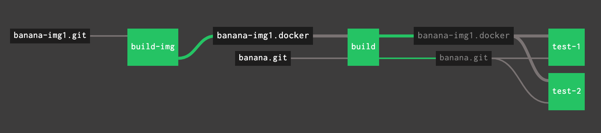

= WIP Building a Docker image inline with the pipeline which consumes it



WARNING: This is work in progress!

== Preparation

1. Replace each occurrence of:
```YAML
  source: {repository: marcomm/banana-img1}
```
with your Docker registry/repository.

2. Change the name of the git repositories and git resources accordingly to your project.

3. Set following parameters in your secret store:

```
dockerhub-username
dockerhub-password
```

For example for Vault:

```
vault kv put /concourse/main/dockerhub-username value=MY_USER
vault kv put /concourse/main/dockerhub-password value=MY_PASSWORD
```

== Usage  

This workflow enables to use a feature branch to test the changes to the Docker images before merging to master branch. As such, we assume one master pipeline and one pipeline per feature branch.

* pipeline for master branch: `banana-master`
* pipeline for feature branch `feat-foo`: `banana-feat-foo`

Set the master branch pipeline:

```shell
fly -t vm set-pipeline -p banana-master \
    -c ci/banana-pipeline.yml \
    -v branch=master
```

Set the pipeline specifying the branch name. This can be error-prone, we suggest using a wrapper that validates the current git repository branch name for you.

```shell
fly -t vm set-pipeline -p banana-(git rev-parse --abbrev-ref HEAD) \
    -c ci/banana-pipeline.yml \
    -v branch=(git rev-parse --abbrev-ref HEAD)
```

= questions

== 1 pipeline (build images and do the real business) or 2 (one to build the image and the other to do the real business) ?

== is it possible to support feature branches or only staging and master ?

Let's start simple with only staging and master.
[] NOTE The image should be built ONLY if there is a change, NOT on each change of the repo!!! How do I do this ? With a path filter on the git repo ???

set BRANCH feat-123

fly -t vm set-pipeline -p banana-$BRANCH \
    -c build-docker-image-pipeline.yml -v branch=$BRANCH

fly -t vm destroy-pipeline -p banana-$BRANCH

== how to delete from the registry old feature branch images ?

cannot delete at the end of each run, because it needs the image!
if i do nothing lot of images build up
but if i use a tag like $BRANCH-latest maybe it works ? if it overrides, then 
i have 1 image per feat branch only. still need to be cleaned out of band by a reaper that deletes the image when the branch disappears from the source git repo.

also need  serial_group to avoid the race when a commit changes files detected by both git resources, for example a chaneg to the dockerfile adding a tool and a change to the build script using the new tool. I confirmed the race in commit wip6. Let's see if I can remove it with serial_gropus. The race is not the end of the world because then a new image will trigger the build again, making it successful at the end.

the inage should have the following tags

- the commit tag of the git repo, tag_file: banana-img-1.git/.git/ref
- a tag like $BRANCH-latest

mhh if I do this, I cannot overwrite the previous image and I geberate loads of crap.

TODO

to enable the tag_file, I must have a more precise `paths` filter, I have to put everythn that impacts the image in a directory

= misc  

deleting images from a registry
https://medium.com/@mcvidanagama/cleanup-your-docker-registry-ef0527673e3a

ask for deletion
curl -v -X DELETE http://registryhost:reigstryport/v2/${docker_image_name}/manifests/${digest}

run garbage collector, it seems there are 2 possibilities

on the registry

REGISTRY_STORAGE_DELETE_ENABLED=true docker exec registry bin/registry garbage-collect /etc/docker/registry/config.yml

or

docker system prune
