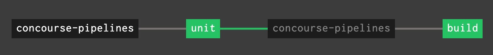

= Building Go code, with and without Go modules

Extensive documentation is at https://www.orsolabs.com/post/building-go-code-with-concourse/

The example code is separated in 2 branches:

* branch `golang-pre-modules` is, well, pre-modules.
* branch `master` is the same code, but converted to modules.

```
├── ci
│   ├── build-golang-pipeline.yml
│   ├── build-task.yml
│   ├── build.sh
│   ├── unit-task.yml
│   └── unit.sh
├── cmd
│   └── cake
│       └── main.go
├── hello
    ├── hello.go
    └── hello_test.go
```


