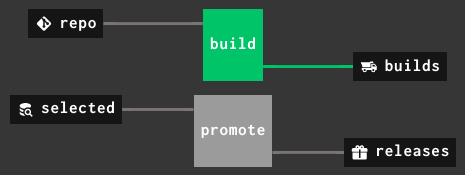

# Making a release triggered by a git tag

Pipeline simple-release.yml:

Pipeline multi-stage-release.yml:

For more details:
* read the blog post [Concourse: making a release triggered by a git tag](WRITEME)
* study the pipeline configuration

Worth noting that the same main pipeline does both normal builds and release builds.

This approach works both for releases only from the master branch or for releases from a release branch.

The S3 resources `builds` and `selected` are actually looking at the same path, but the regex is different, so that when `selected` triggers, the artifact is copied to the `releases` S3 resource.

The example here is with S3, but you could use any other storage system (with the proper Concourse resource).
